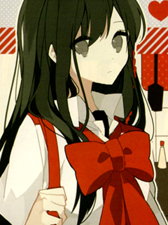

# Killing Art

Programs that control your mouse to draw pictures in Paint.

Most programs activate immediately upon pressing `9`. Some activate via `Alt+D`. Draw_Circle activates by pressing `Space`, moving your mouse to the desired radius, then releasing `Space` and holding down `Mouse1` so it can draw.

Most programs can be stopped immediately via `Esc`.

Eventually all programs will use `Alt+D` as a standard.
